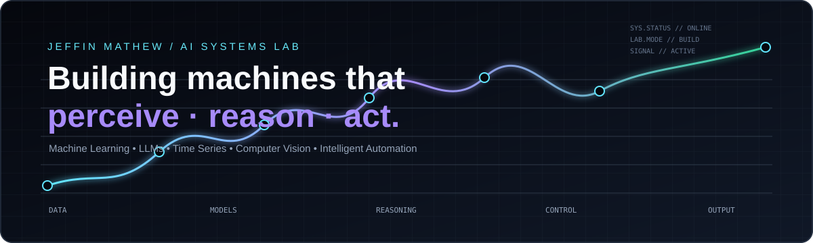

<div align="center">



<p>
  <a href="https://github.com/JEFFIN-alt"></a>
  <a href="mailto:jeffinmathew453@gmail.com"></a>
</p>

</div>

> **AI & Data Science student building intelligent systems from raw signals to real-world decisions.**

---

## AI SYSTEMS I BUILD

```text
                         ┌─────────────────────────┐
                         │     MACHINE INTELLIGENCE │
                         └────────────┬────────────┘
                                      │
             ┌────────────────────────┼────────────────────────┐
             ▼                        ▼                        ▼
       ┌───────────┐            ┌───────────┐            ┌────────────┐
       │ PERCEIVE  │            │  REASON   │            │    ACT     │
       └─────┬─────┘            └─────┬─────┘            └─────┬──────┘
             │                        │                        │
     Computer Vision          LLMs · RAG · Agents       Automation
     Sensor Fusion            Deep Learning             Intelligent Control
     Time Series              Machine Learning          Decision Systems
             │                        │                        │
             └────────────────────────┼────────────────────────┘
                                      ▼
                         ┌─────────────────────────┐
                         │   WORKING AI SYSTEM     │
                         │  data → model → action  │
                         └─────────────────────────┘
```

I like the part where a model stops being a notebook experiment and becomes a **system** — something that can interpret signals, make decisions, and produce a useful outcome.

**Core interests:** `Machine Learning` · `Deep Learning` · `LLMs` · `RAG` · `AI Agents` · `Time-Series` · `Computer Vision` · `Intelligent Automation`

---

## SELECTED SYSTEMS

### 🌊 Multi-Reservoir Water Management
**AI-assisted reservoir coordination & flood prevention**

A research-oriented system combining inflow forecasting, multi-reservoir simulation, reinforcement-learning control, continual learning, and an operator dashboard. The goal is to balance water preservation with downstream flood risk.  
**Stack:** `Python` `NumPy` `Pandas` `Scikit-learn` `NetworkX` `Plotly` `Streamlit` `Jupyter`

→ [Explore the system](https://github.com/JEFFIN-alt/AI-BASED-MULTI-RESERVOIR-WATER-MANAGEMENT-AND-FLOOD-PREVENTION-SYSTEM)

---

### ⚙️ Multi-Sensor Motor Intelligence
**Real-time anomaly detection + predictive maintenance**

An LSTM Autoencoder learns normal industrial sensor behaviour and detects deviations from live Arduino streams. The project also explores Remaining Useful Life prediction with the NASA CMAPSS benchmark, connecting edge sensing, ML inference, and monitoring dashboards.  
**Stack:** `Python` `TensorFlow/Keras` `LSTM` `Arduino` `MPU6050` `Flask` `Streamlit` `Plotly`

→ [Explore the system](https://github.com/JEFFIN-alt/lstm-motor-anomaly-detection)

---

### ◈ OpenLLM Gateway
**A lightweight interface for multi-model AI**

A practical LLM application providing a unified interface to free/open models through OpenRouter, with model switching, automatic free-model routing, session conversation memory, and a Streamlit interface.  
**Stack:** `Python` `Streamlit` `OpenRouter`

→ [Explore the gateway](https://github.com/JEFFIN-alt/OpenLLM-Gateway) · [Live demo](https://openllm.streamlit.app/)

---

### ◎ Smart Attendance System
**Computer vision applied to an everyday workflow**

A practical automation project focused on using AI/computer vision to make attendance handling more intelligent and less manual.

→ [Explore the project](https://github.com/JEFFIN-alt/smart-attendance_system)

---

## CURRENT WORKBENCH

```text
[ ACTIVE ]  OpenLLM Gateway
           └─ multi-model AI interfaces · LLM application patterns

[ ACTIVE ]  Intelligent Sensor Anomaly Detection
           └─ time-series intelligence · predictive maintenance

[ ACTIVE ]  Multi-Reservoir Intelligence
           └─ forecasting · simulation · intelligent control

[ EXPLORING ]
           └─ RAG · AI Agents · multimodal systems · production AI
```

---

## ENGINEERING STACK

| Layer | Technologies |
|---|---|
| **Languages** | `Python` · `C` · `Java` · `SQL` |
| **AI / ML** | `TensorFlow` · `Keras` · `Scikit-learn` · `LSTM` |
| **LLM / GenAI** | `LangChain` · `OpenRouter` · `LLM Applications` |
| **Data** | `Pandas` · `NumPy` · `Time-Series` · `Plotly` |
| **Applications** | `Streamlit` · `Flask` · `Jupyter` |
| **Systems** | `Arduino` · `Git` · `Linux` |

---

## THE DIRECTION

<div align="center">

### PERCEIVE  →  REASON  →  DECIDE  →  ACT

</div>

My long-term interest is not simply building better models. It is building **intelligent systems around models** — systems that can understand their environment, reason over information, make decisions under constraints, and turn those decisions into action.

That means moving toward **LLMs + RAG + Agents + multimodal perception + automation + reliable system design**.

---

## SIGNAL LOG

```text
AI/ML        ████████████████████  building
LLM systems  ████████████████░░░░  exploring
RAG          █████████████░░░░░░  exploring
AI Agents    ████████████░░░░░░░░  exploring
Time Series  █████████████████░░░  building
CV / Vision  ███████████████░░░░░  building
Automation   ██████████████░░░░░░  building
```

<div align="center">

---

**JEFFIN MATHEW**  
*AI Systems Laboratory · Build → Measure → Learn → Iterate*

</div>
